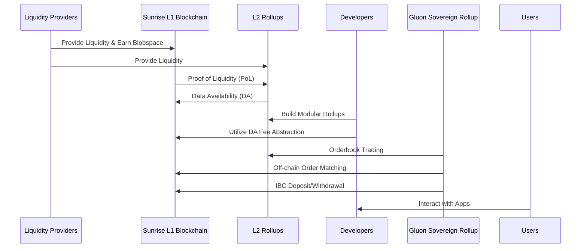
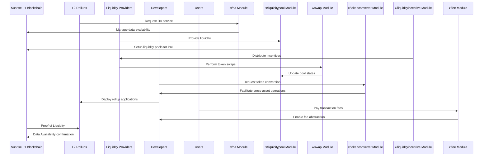

# Sunrise

## Overview
The Sunrise ecosystem is a modular blockchain framework designed to enhance scalability, security, and liquidity for decentralized applications (DApps) and rollups. It leverages **Proof of Liquidity (PoL)** and **Data Availability (DA)** mechanisms to ensure efficient operation of Layer 2 (L2) rollups while incentivizing liquidity providers.

---

## Key Components

### **Sunrise L1 Blockchain**
- **Role**: The foundational layer of the ecosystem.
- **Features**:
    - Implements **Proof of Liquidity (PoL)** to incentivize liquidity provision and ensure secure data availability.
    - Provides **Data Availability (DA)** to L2 rollups for scalability and security.

---

### **L2 Rollups**
- **Role**: Scalable Layer 2 solutions built on Sunrise.
- **Features**:
    - Leverage Sunrise's modular architecture for efficient transaction processing.
    - Depend on PoL and DA mechanisms provided by the Sunrise L1 Blockchain.

---

### **Liquidity Providers**
- **Role**: Backbone of the PoL mechanism.
- **Features**:
    - Supply liquidity to earn **blobspace**, which is used for data publication.
    - Enable rollups by providing liquidity to the ecosystem.

---

### **Developers**
- **Role**: Builders of decentralized applications (DApps).
- **Features**:
    - Build modular rollups on L2 using Sunrise’s infrastructure.
    - Utilize technical modules like `x/da`, `x/tokenconverter`, and `x/swap` for scalable application development.

---

### **Gluon Sovereign Rollup**
- **Role**: Specialized rollup deployed on Sunrise.
- **Features**:
    - **Orderbook Trading**: On-chain trading with decentralized orderbooks.
    - **Off-chain Order Matching**: Efficient transaction processing.
    - IBC-based deposit/withdrawal processes for interoperability across blockchains.

---

### **Users**
- **Role**: End-users who interact with applications built by developers on L2 rollups.
- **Features**:
    - Benefit from secure, scalable infrastructure provided by Sunrise Blockchain and Rollups.
    - Engage with DApps seamlessly via fee abstraction mechanisms.

---

## Technical Components

The Sunrise ecosystem is powered by a set of modular components that enable its functionality:

| Module Name             | Description                                                                 |
|-------------------------|-----------------------------------------------------------------------------|
| `x/da Module`           | Manages data availability mechanisms for rollups.                          |
| `x/liquiditypool Module`| Handles liquidity provisioning by contributors.                            |
| `x/swap Module`         | Enables token swaps within liquidity pools.                                |
| `x/tokenconverter Module` | Facilitates token conversions for applications.                          |
| `x/liquidityincentive Module` | Provides incentives to liquidity providers.                          |
| `x/fee Module`          | Governs transaction fees and supports fee abstraction for developers.      |

---

## Interaction Flow

### High-Level Workflow
1. Liquidity providers contribute liquidity → Earn blobspace → Support PoL and DA mechanisms in Sunrise L1 Blockchain.
2. Developers build modular rollups → Utilize DA fee abstraction → Deploy scalable apps on L2 Rollups.
3. Gluon Sovereign Rollup facilitates advanced trading features → Interacts with both Sunrise Blockchain (for settlement) and users (for trading).
4. Users engage with DApps built by developers → Leverage secure & scalable infrastructure provided by Sunrise Blockchain & Rollups.

## Explanation of Diagrams

### Diagram 1: High-Level Architecture

This diagram provides an overview of how various entities interact within the Sunrise ecosystem:

- **Sunrise L1 Blockchain**: Implements Proof of Liquidity (PoL) and Data Availability (DA) for security and scalability.
- **L2 Rollups**: Built on Sunrise; depend on PoL and DA mechanisms for operations.
- **Liquidity Providers**: Supply liquidity, earning blobspace rewards while supporting rollups' security.
- **Developers**: Build DApps on modular L2 Rollups using Sunrise infrastructure.
- **Gluon Sovereign Rollup**: Specialized rollup offering orderbook trading, off-chain matching, and IBC-based deposits/withdrawals.
- **Users**: Interact with DApps built on L2 Rollups.

### Diagram 2: Technical Components

This diagram highlights key technical modules powering the ecosystem:

- `x/da Module`: Manages data availability for rollups.
- `x/liquiditypool Module`: Handles liquidity provisioning for PoL.
- `x/swap Module`: Enables token swaps within pools.
- `x/tokenconverter Module`: Facilitates token conversions across assets.
- `x/liquidityincentive Module`: Incentivizes liquidity providers to participate in PoL.
- `x/fee Module`: Manages transaction fees; supports fee abstraction for developers building DApps.

